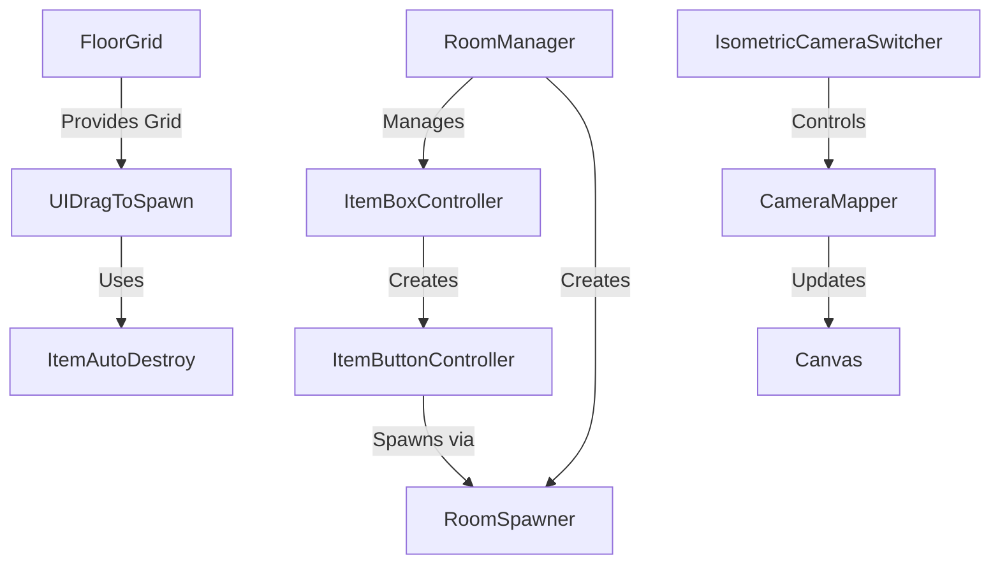

# Greg's Room - System Architecture

## Overview



## Core Systems

### 1. Room Management System
- **RoomManager** (`RoomManager.cs`)
  - Controls room progression and transitions
  - Manages room data including available items for each room
  - Coordinates with ItemBoxController to display available items
  - Uses a transition panel for smooth room changes
  ```csharp
  public class RoomData {
      public GameObject roomPrefab;
      public List<Sprite> itemIcons;
      public List<GameObject> itemPrefabs;
  }
  ```

### 2. Grid & Placement System
- **Floor Grid** (`FloorGrid.cs`)
  - Implements an isometric grid system (12x12 by default)
  - Provides snapping functionality for placed objects
  - Visual feedback through highlight tiles
  - Key features:
    - Grid dimensions: 12x12 cells
    - Cell size: 0.1 units
    - Visual grid in editor for easy setup
    - Highlight system for valid placement areas

### 3. Item Management System
- **Item Box Controller** (`ItemBoxController.cs`)
  - Manages the UI for available items
  - Creates and maintains item buttons
  - Coordinates with RoomManager for item availability
  - Features:
    - Dynamic slot system (default: 5 slots)
    - Customizable button layout
    - Automatic UI positioning

- **Item Button Controller** (`ItemButtonController.cs`)
  - Handles individual item button functionality
  - Triggers item spawning through RoomSpawner
  - Simple prefab reference system

### 4. Object Spawning & Placement
- **Room Spawner** (`RoomSpawner.cs`)
  - Singleton pattern for global access
  - Manages object instantiation
  - Handles parent hierarchy for spawned objects
  - Maintains organization through ItemSpawnRoot

- **UI Drag System** (`UIDrag.cs`)
  - Implements drag-and-drop functionality
  - Integrates with FloorGrid for placement
  - Manages object lifecycle through ItemAutoDestroy
  - Features:
    - Drag preview
    - Position validation
    - Automatic cleanup for invalid placements

### 5. Camera System
- **Camera Controls** (`IsometricCameraSwitcher.cs` & `CameraMapper.cs`)
  - Multiple camera view support
  - Seamless camera switching
  - Canvas management for UI elements
  - Mouse position mapping for accurate interaction
  - Features:
    - World-space mouse position tracking
    - Automatic canvas camera assignment
    - Panel offset support (-0.15 units)

## Scaling Considerations

### Current Implementation
1. **Room Progression**
   - Simple linear progression through rooms
   - Room data structure ready for expansion
   - Transition system in place

2. **Object Placement**
   - Basic grid system implemented
   - Snapping and highlighting working
   - No Chi system implementation yet

3. **UI System**
   - Flexible item box system
   - Camera controls ready for multiple views
   - Basic drag-and-drop functionality

### Needed for Full Implementation

1. **Chi System**
   - Add Chi values to placed objects
   - Implement Chi calculation system
   - Create Chi visualization
   - Add Chi effects on gameplay

2. **Life Choice System**
   - Extend RoomData to include choice implications
   - Add special object types for life choices
   - Implement choice tracking system
   - Create outcome calculation system

3. **Save/Load System**
   - Add room state persistence
   - Save player choices
   - Track Chi history
   - Store multiple playthroughs

4. **UI Enhancements**
   - Add Chi score display
   - Implement choice preview system
   - Create outcome summary screen
   - Add tutorial elements

5. **Gameplay Extensions**
   - Add object interaction system
   - Implement room completion criteria
   - Create dynamic difficulty adjustment
   - Add ambient animations

## Design Patterns Used

1. **Singleton Pattern**
   - Used in RoomSpawner for global access
   - Ensures single point of control for object spawning

2. **Component-Based Architecture**
   - Clear separation of concerns
   - Modular system design
   - Easy to extend and modify

3. **Event-Based Communication**
   - UI events for drag and drop
   - Room transition system
   - Camera switch events

## Future Optimization Opportunities

1. **Object Pooling**
   - Implement for frequently spawned objects
   - Reduce garbage collection
   - Improve performance during rapid placement

2. **Grid System**
   - Optimize snap calculations
   - Add multi-tile object support
   - Implement zone-based Chi calculations

3. **UI System**
   - Add object rotation support
   - Implement preview system
   - Add undo/redo functionality

4. **Data Management**
   - Add scriptable objects for configuration
   - Implement proper save/load system
   - Add room templates system
