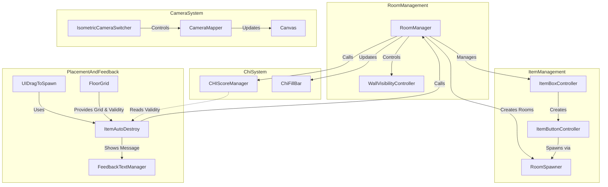

# Greg's Room - System Architecture

## Overview



## Core Systems

### 1. Room Management System
- **RoomManager** (`RoomManager.cs`)
  - Controls room progression and transitions
  - Manages room data including available items for each room
  - Coordinates with ItemBoxController to display available items
  - Uses a transition panel for smooth room changes (2-second duration)
  - Room transitions use a black screen fade effect
  - Tracks both current room CHI score and total CHI score
  - Maximum CHI score set to 20 points
  - Manages wall visibility through WallVisibilityController
  - Automatically switches to main camera view on room change

```csharp
public class RoomData {
    public GameObject roomPrefab;
    public List<GameObject> buttonPrefabs; // Updated to use button prefabs directly
}
```

### 2. Grid & Placement System
- **Floor Grid** (`FloorGrid.cs`)
  - Implements an isometric grid system (100x100 by default)
  - Provides snapping functionality for placed objects
  - Visual feedback through highlight tiles
  - Key features:
    - Grid dimensions: 100x100 cells
    - Cell size: 0.05 units
    - Floor offset configuration (X: 0.4, Y: -0.32, Z: 0.4)
    - Edge-based snapping system
    - Highlight tile prefab system
    - Dynamic room collider reference
    - Snapping supports rotation-aware bounding box recalculations
    - Grid debug visuals available for testing
    - Object auto-destruction and item reset on invalid placement
    - Provides IsCurrentHighlightValid flag for visual-logic alignment
    - Highlight color indicates placement validity (red/green)

- **UI Drag System** (`UIDrag.cs`)
  - Implements drag-and-drop functionality
  - Integrates with FloorGrid for placement
  - Manages object lifecycle through ItemAutoDestroy
  - Features:
    - Drag preview
    - Position validation
    - 90-degree object rotation via right-click
    - Runtime collider toggling for placement accuracy
    - Dynamic anchor logic (e.g. top-right)
    - Post-rotation size recalculation
    - Ensures prefab-scene communication via runtime component lookup

### 3. Item Management System
- **Item Box Controller** (`ItemBoxController.cs`)
  - Manages the UI for available items
  - Creates and maintains item buttons dynamically based on room state
  - Uses prefab-based button system
  - Features:
    - Direct prefab instantiation
    - Dynamic button layout
    - Room-specific button configurations
    - Automatic cleanup on room change
    - Customizable button layout (default: 5 slots)
    - Pixel art UI with background and icons

- **Item Button Controller** (`ItemButtonController.cs`)
  - Handles individual item button functionality
  - Triggers item spawning through RoomSpawner
  - Simple prefab reference system

### 4. Object Spawning & Placement
- **Room Spawner** (`RoomSpawner.cs`)
  - Singleton pattern for global access
  - Manages object instantiation under ItemSpawnRoot
  - Features:
    - Dynamic parent hierarchy
    - Mouse position to world space conversion
    - Camera-aware placement system
    - Integration with CameraMapper for accurate spawning

- **Item AutoDestroy** (`ItemAutoDestroy.cs`)
  - Validates object placement within room bounds
  - Manages placement feedback and cleanup
  - Features:
    - Room bounds checking with 5-unit vertical tolerance
    - Custom feedback messages per item type
    - Automatic cleanup of invalid placements
    - CHI score update triggers

### 5. Chi Energy System
- **Feedback Text System** (`FeedBack.cs`)
  - Singleton pattern for global access via FeedbackTextManager.Instance
  - Shows temporary placement feedback messages (2-second duration)
  - Color-coded messages (green for success, red for failure)
  - Uses TextMeshProUGUI for pixel-perfect text rendering
  - Automatically hides messages after delay
  - Supports message interruption/override

- **CHIScoreManager** (`CHIScoreManager.cs`)
  - Singleton managing CHI score calculations
  - Features:
    - Dictionary-based score mapping
    - Current implemented scores:
      - Plant: 5 points
      - Bed: 3 points
      - Basketball: 10 points
      - TrashBin: -3 points
      - Toilet: -5 points
    - Real-time score calculation
    - Validity checking through ItemAutoDestroy
    - Debug logging system
    - Calculates total CHI by iterating through placed items
    - Checks ItemAutoDestroy.isValidPlacement status for each item

- **Object Placement Integration**
  - ItemAutoDestroy determines validity from FloorGrid.IsCurrentHighlightValid
  - Triggers RoomManager.RefreshCHIScore after placement/deletion
  - Items detached before destruction for accurate score updates
  - Immediate recalculation ensures up-to-date CHI display

- **Chi Bar UI (`ChiFillBar.cs`)**
  - Visual progress bar using Unity UI Image
  - Smooth fill amount updates via chiFillImage.fillAmount
  - Maximum value set to 20 for clear visual scaling
  - Updated by RoomManager after score calculations
  - Supports immediate visual feedback on placement/deletion

### 6. Camera System
- **Camera Controls** (`IsometricCameraSwitcher.cs` & `CameraMapper.cs`)
  - Multiple camera view support
  - Seamless camera switching
  - Canvas management for UI elements
  - Mouse position mapping for accurate interaction
  - Features:
    - World-space mouse position tracking
    - Automatic canvas camera assignment
    - Panel offset support (-0.15 units)
    - Canvas worldCamera references updated on switch

- **Camera Setup**
  - Main Camera: (-7.25, 10.79, -7.25) at 30° X, 45° Y
  - Side Camera: (7.25, 10.79, -7.25) at 30° X, 315° Y
  - Lighting System:
    - Key Light: 50° angle at 135° rotation
    - Fill Light: 50° angle at 315° rotation
    - Top Light: 90° straight down
  - Canvas positioned at (11.12, -4.21, 11.12) with 0.022 scale

### 7. UI System
- **Main Canvas Layout**
  - Camera Switch Button: (760, 410)
  - Next Room Button: (760, -340)
  - Item Box Panel: (-760, -3.2)
    - Content area offset: (0, -50)
    - Title text offset: (0, 480)
  - CHI Bar System:
    - Base position: (-400, 480)
    - Score display: (825, -15)
    - Feedback text: (400, -900)

## Current Implementation Status

1. **Room System**
   - Multiple room support implemented
   - Smooth transitions with fade effect
   - Wall visibility control system
   - Automatic camera positioning
   - ItemSpawnRoot organization

2. **Placement System**
   - Grid-based placement
   - Edge snapping system
   - Bounds validation
   - Custom feedback per item
   - Rotation support

3. **CHI System**
   - Score tracking per room
   - Global score accumulation
   - Visual feedback
   - Item-specific scoring
   - Real-time updates

4. **Camera System**
   - Dual camera setup
   - Three-point lighting
   - Dynamic canvas updating
   - Screen-to-world conversion

## Scaling Considerations

### Current Implementation
1. **Room Progression**
   - Simple linear progression through rooms
   - Room data structure ready for expansion
   - Transition system with black screen fade between rooms
   - Shared room prefab reused via camera angles

2. **Object Placement & Chi System**
   - Grid-based placement with visual validity feedback
   - Chi energy system with visual progress bar (max 20)
   - Validation through FloorGrid highlight color
   - Score recalculation on place/destroy
   - Immediate UI updates with feedback messages
   - Per-item CHI scores with both positive and negative values

3. **UI System**
   - Flexible item box system
   - Pixel-perfect button system
   - Separate canvases for loading and interaction
   - Layered render control for UI vs 3D

4. **Drag & Rotation**
   - Right-click rotation with updated snapping bounds
   - Runtime collider toggle avoids drag glitches
   - Dynamic anchor alignment supported

5. **Prefabs & Safety**
   - All item buttons and objects are prefabs
   - Object size initialized correctly to avoid embedding issues
   - Scene references dynamically located via Start()

## Future Development Priorities

1. **CHI System Extensions**
   - Add more item scores
   - Implement score animations
   - Add milestone rewards
   - Expand feedback system

2. **Room System**
   - Add more room templates
   - Implement room completion criteria
   - Add environmental interactions
   - Expand wall visibility options

3. **UI Improvements**
   - Add tutorial system
   - Implement help overlays
   - Add item descriptions
   - Enhance feedback visuals

4. **Technical Optimizations**
   - Implement object pooling
   - Add save/load system
   - Optimize grid calculations
   - Add undo/redo system

## Design Patterns Used

1. **Singleton Pattern**
   - Used in RoomSpawner for global access
   - Ensures single point of control for object spawning

2. **Component-Based Architecture**
   - Clear separation of concerns
   - Modular system design
   - Easy to extend and modify

3. **System Communication**
   - UI events for drag and drop
   - Room transition system
   - Camera switch events
   - Direct score recalculation
   - Visual feedback messages
   - Real-time UI updates

## Future Optimization Opportunities

1. **Object Pooling**
   - Implement for frequently spawned objects
   - Reduce garbage collection
   - Improve performance during rapid placement

2. **Grid System**
   - Optimize snap calculations
   - Add multi-tile object support
   - Implement zone-based Chi calculations

3. **UI System**
   - Add object rotation support
   - Implement preview system
   - Add undo/redo functionality

4. **Data Management**
   - Add scriptable objects for configuration
   - Implement proper save/load system
   - Add room templates system

5. **Debug & Test Tools**
   - Add test scenes for each feature
   - Canvas visibility toggles
   - Branch testing debug overlay
