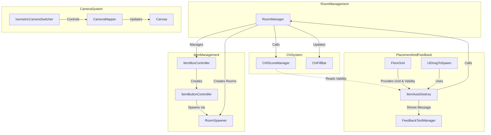

# Greg's Room - System Architecture

## Overview



## Core Systems

### 1. Room Management System
- **RoomManager** (`RoomManager.cs`)
  - Controls room progression and transitions
  - Manages room data including available items for each room
  - Coordinates with ItemBoxController to display available items
  - Uses a transition panel for smooth room changes
  - Room transitions use a black screen fade effect (placeholder for future cutscenes)
  - Rooms are currently represented via camera switches over one shared model
  - All items are prefabs and can be reused across rooms

```csharp
public class RoomData {
    public GameObject roomPrefab;
    public List<Sprite> itemIcons;
    public List<GameObject> itemPrefabs;
}
```

### 2. Grid & Placement System
- **Floor Grid** (`FloorGrid.cs`)
  - Implements an isometric grid system (12x12 by default)
  - Provides snapping functionality for placed objects
  - Visual feedback through highlight tiles
  - Key features:
    - Grid dimensions: 12x12 cells
    - Cell size: 0.1 units
    - Adjustable grid direction, offset, and anchor logic
    - Snapping supports rotation-aware bounding box recalculations
    - Grid debug visuals available for testing
    - Object auto-destruction and item reset on invalid placement
    - Provides IsCurrentHighlightValid flag for visual-logic alignment
    - Highlight color indicates placement validity (red/green)

- **UI Drag System** (`UIDrag.cs`)
  - Implements drag-and-drop functionality
  - Integrates with FloorGrid for placement
  - Manages object lifecycle through ItemAutoDestroy
  - Features:
    - Drag preview
    - Position validation
    - 90-degree object rotation via right-click
    - Runtime collider toggling for placement accuracy
    - Dynamic anchor logic (e.g. top-right)
    - Post-rotation size recalculation
    - Ensures prefab-scene communication via runtime component lookup

### 3. Item Management System
- **Item Box Controller** (`ItemBoxController.cs`)
  - Manages the UI for available items
  - Creates and maintains item buttons dynamically based on room state
  - Coordinates with RoomManager for item availability
  - Features:
    - Dynamic prefab binding on button creation
    - Customizable button layout (default: 5 slots)
    - Pixel art UI with background and icons
    - Room-based refresh logic on transition

- **Item Button Controller** (`ItemButtonController.cs`)
  - Handles individual item button functionality
  - Triggers item spawning through RoomSpawner
  - Simple prefab reference system

### 4. Object Spawning & Placement
- **Room Spawner** (`RoomSpawner.cs`)
  - Singleton pattern for global access
  - Manages object instantiation
  - Handles parent hierarchy for spawned objects
  - Maintains organization through ItemSpawnRoot

- **Item AutoDestroy** (`ItemAutoDestroy.cs`)
  - Determines whether an object was placed validly
  - Sends event to PlacementManager on success
  - Cleans up or resets objects when out-of-bounds

### 5. Chi Energy System
- **Feedback Text System** (`FeedBack.cs`)
  - Singleton pattern for global access via FeedbackTextManager.Instance
  - Shows temporary placement feedback messages (2-second duration)
  - Color-coded messages (green for success, red for failure)
  - Uses TextMeshProUGUI for pixel-perfect text rendering
  - Automatically hides messages after delay
  - Supports message interruption/override

- **CHIScoreManager** (`CHIScoreManager.cs`)
  - Singleton managing CHI score calculations
  - Features:
    - Dictionary-based score mapping (prefab name to point value)
    - Calculates total CHI by iterating through placed items
    - Checks ItemAutoDestroy.isValidPlacement status for each item
    - Example scores: Plant (5), Bed (3), Table (2), TrashBin (-3)
    - Debug logging for score calculation transparency
    - Called by RoomManager for score updates

- **Object Placement Integration**
  - ItemAutoDestroy determines validity from FloorGrid.IsCurrentHighlightValid
  - Triggers RoomManager.RefreshCHIScore after placement/deletion
  - Items detached before destruction for accurate score updates
  - Immediate recalculation ensures up-to-date CHI display

- **Chi Bar UI (`ChiFillBar.cs`)**
  - Visual progress bar using Unity UI Image
  - Smooth fill amount updates via chiFillImage.fillAmount
  - Maximum value set to 9 for clear visual scaling
  - Updated by RoomManager after score calculations
  - Supports immediate visual feedback on placement/deletion

### 6. Camera System
- **Camera Controls** (`IsometricCameraSwitcher.cs` & `CameraMapper.cs`)
  - Multiple camera view support
  - Seamless camera switching
  - Canvas management for UI elements
  - Mouse position mapping for accurate interaction
  - Features:
    - World-space mouse position tracking
    - Automatic canvas camera assignment
    - Panel offset support (-0.15 units)
    - Canvas worldCamera references updated on switch

## Scaling Considerations

### Current Implementation
1. **Room Progression**
   - Simple linear progression through rooms
   - Room data structure ready for expansion
   - Transition system with black screen fade between rooms
   - Shared room prefab reused via camera angles

2. **Object Placement & Chi System**
   - Grid-based placement with visual validity feedback
   - Chi energy system with visual progress bar (max 9)
   - Validation through FloorGrid highlight color
   - Score recalculation on place/destroy
   - Immediate UI updates with feedback messages
   - Per-item CHI scores with both positive and negative values

3. **UI System**
   - Flexible item box system
   - Pixel-perfect button system
   - Separate canvases for loading and interaction
   - Layered render control for UI vs 3D

4. **Drag & Rotation**
   - Right-click rotation with updated snapping bounds
   - Runtime collider toggle avoids drag glitches
   - Dynamic anchor alignment supported

5. **Prefabs & Safety**
   - All item buttons and objects are prefabs
   - Object size initialized correctly to avoid embedding issues
   - Scene references dynamically located via Start()

### Needed for Full Implementation

1. **Chi System Extensions**
   - Add pixel pop-up showing points gained/lost on placement
   - Implement Chi depletion mechanics
   - Add special effects for Chi milestones
   - Consider Chi-based room progression
   - Extend base score system for all item types

2. **Life Choice System**
   - Extend RoomData to include choice implications
   - Add special object types for life choices
   - Implement choice tracking system
   - Create outcome calculation system

3. **Save/Load System**
   - Add room state persistence
   - Save player choices
   - Track Chi history
   - Store multiple playthroughs

4. **UI Enhancements**
   - Add Chi score display
   - Implement choice preview system
   - Create outcome summary screen
   - Add tutorial elements

5. **Gameplay Extensions**
   - Add object interaction system
   - Implement room completion criteria
   - Create dynamic difficulty adjustment
   - Add ambient animations
   - Cutscenes on room transitions

## Design Patterns Used

1. **Singleton Pattern**
   - Used in RoomSpawner for global access
   - Ensures single point of control for object spawning

2. **Component-Based Architecture**
   - Clear separation of concerns
   - Modular system design
   - Easy to extend and modify

3. **System Communication**
   - UI events for drag and drop
   - Room transition system
   - Camera switch events
   - Direct score recalculation
   - Visual feedback messages
   - Real-time UI updates

## Future Optimization Opportunities

1. **Object Pooling**
   - Implement for frequently spawned objects
   - Reduce garbage collection
   - Improve performance during rapid placement

2. **Grid System**
   - Optimize snap calculations
   - Add multi-tile object support
   - Implement zone-based Chi calculations

3. **UI System**
   - Add object rotation support
   - Implement preview system
   - Add undo/redo functionality

4. **Data Management**
   - Add scriptable objects for configuration
   - Implement proper save/load system
   - Add room templates system

5. **Debug & Test Tools**
   - Add test scenes for each feature
   - Canvas visibility toggles
   - Branch testing debug overlay
